# fashion-segmentation

Detect which pixels of your product images actually belong to the product.
We use up to 4 images as input because on many fashion images, you need multiple images as context to know which fashion item must be segmentated. In the following image you can see that the person wears a jacked, a t-shirt and a jeans. But only with all 4 images, it is clear to the network that the jacked must be segmentated.

<p align="center">
    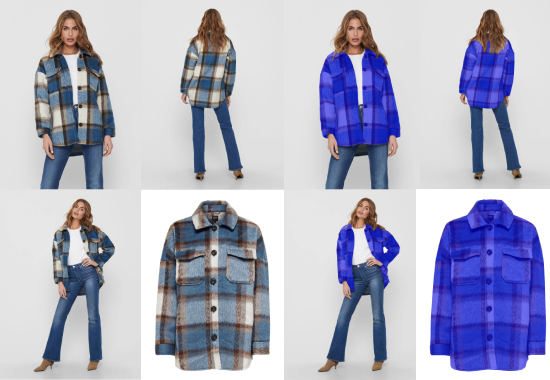
</p>

The segmentation data enables you to extract the actual meaning of your product images by calculating the accurate color or extracting patches and shapes.

<p align="center">
    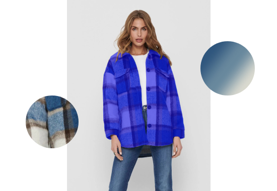
</p>


# Use cases


With the generated data, you can build next-level features, such as a detailed color search, attractive variation previews or find other products with the same color.

<p align="center">
    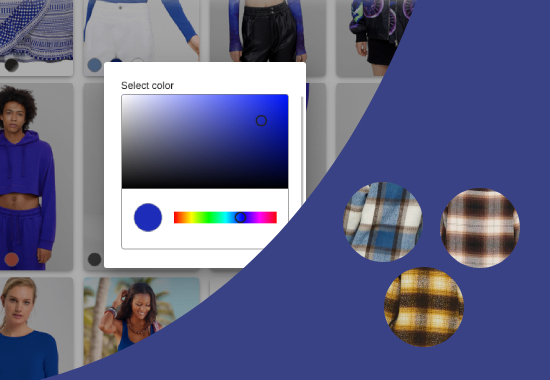
</p>


# Usage

1. Clone this github repository `git clone https://github.com/pubkey/fashion-segmentation.git`.
2. Build the image `docker build -t fashion-segmentation .`
3. Start the container `docker run -it -p 5000:5000 fashion-segmentation`

Or use the docker-compose.yml in the project via `docker compose up`

3. Now you can make requests by sending the pixel data of 4 images to the server. You can find an example on how to do this in node.js in the [examples folder](./examples/nodejs-example.ts).

## Example output

(You can reproduce these results by running `npm run test`)

Input                      |  Output bitmap            |  Output segmentated       |
:-------------------------:|:-------------------------:|:-------------------------:|
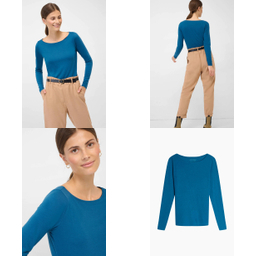    |  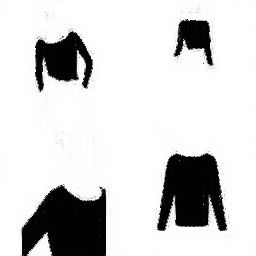 |  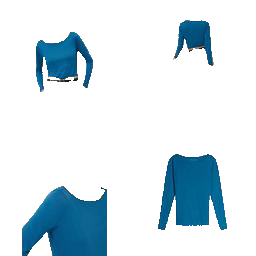
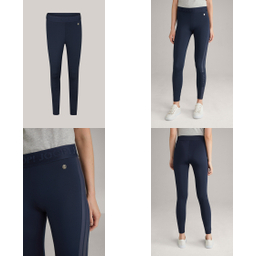    |  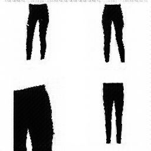 |  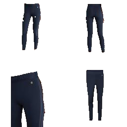
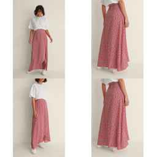    |  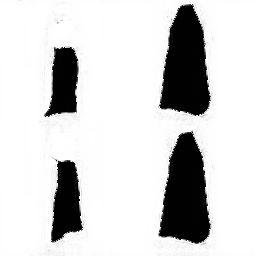 |  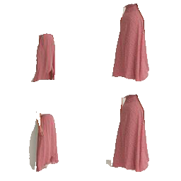

Output colors example:

```json
[
    {
        "hex": "#212534",
        "percentage": 100
    }
]
```

# Get a better trained higher resolution model

In this repo you can find the low resolution (128x128) model that can be used for testing it out. To get access to the better trained model with higher resolution input images, you can [buy it from me](https://gitter.im/pubkey/). The higher resolution model gives a more detailed output and is able to better detect the shapes and surface of the fashion item which reduces false positives. It was trained on 3 times more training data.

## Example output of the bigger model

Input                      |  Output bitmap            |  Output segmentated
:-------------------------:|:-------------------------:|:-------------------------:
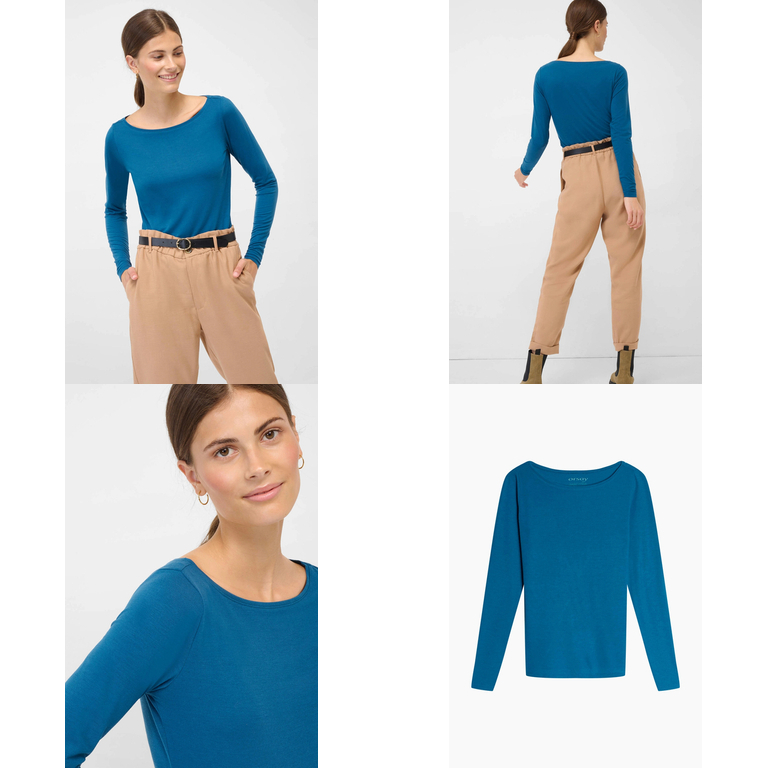    |  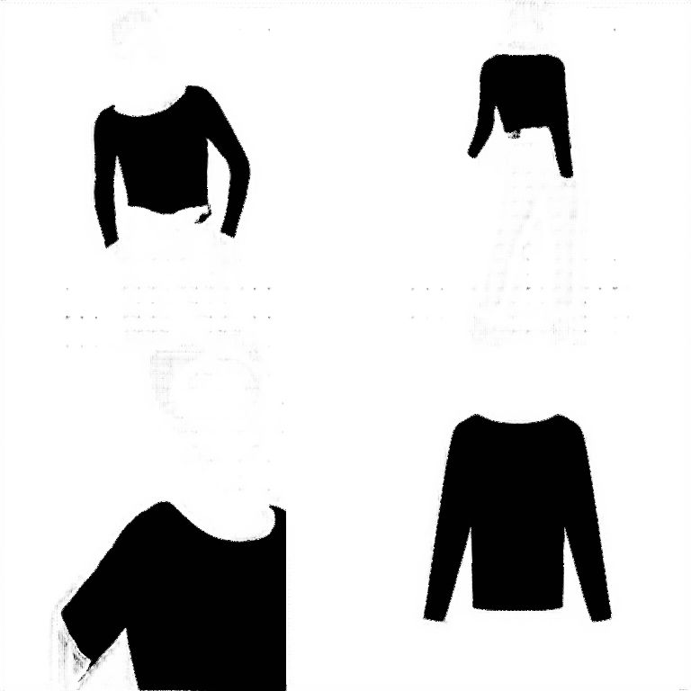 |  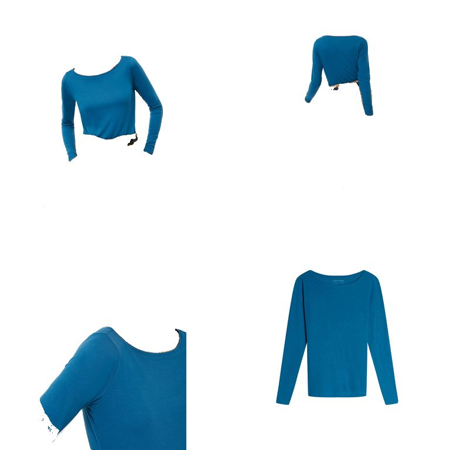
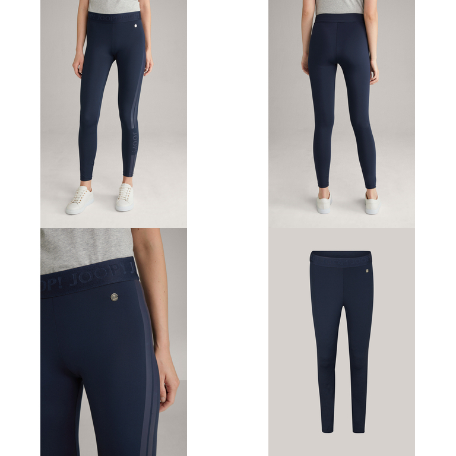    |  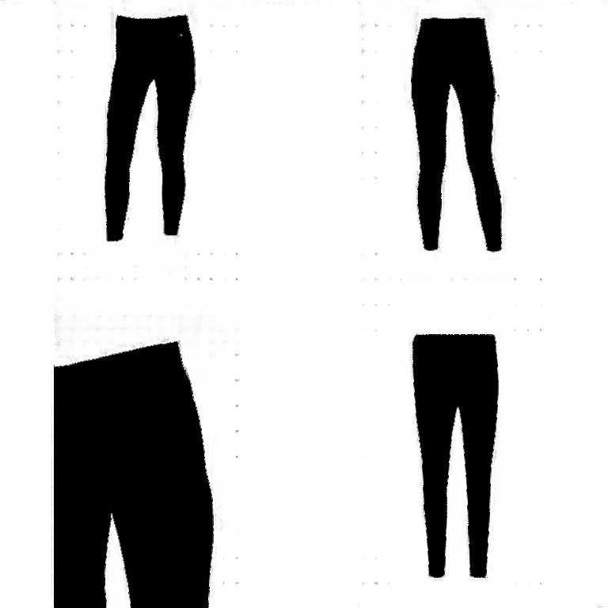 |  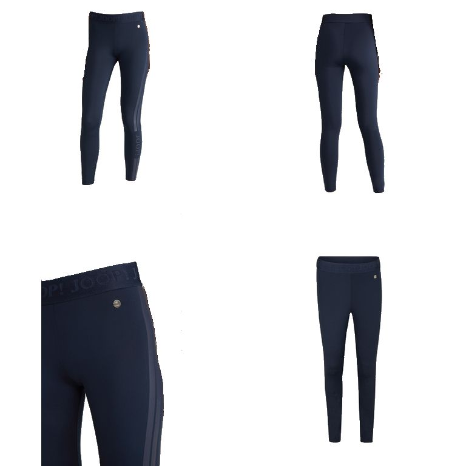
